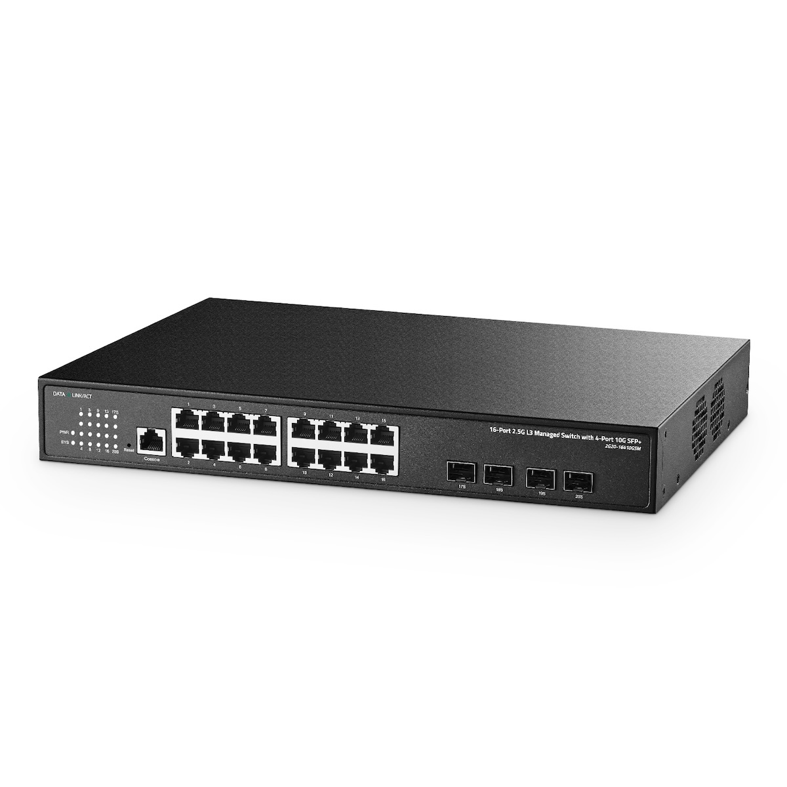

# binardat-switch-config

A Python library for configuring Binardat brand network switches from default settings to custom configurations.

## About Binardat Switches

This project was developed for the **Binardat 2G20-16410GSM** 20-Port 2.5G Web Managed Switch.



### Hardware Specifications

- **Model:** 2G20-16410GSM
- **Ports:** 16x 2.5G Ethernet + 4x 10G SFP+
- **Management:** Web/CLI L3 Managed
- **Form Factor:** Desktop/Rackmount Metal

### Default Settings

When factory reset, the switch defaults to:

- **IP Address:** `192.168.2.1`
- **Username:** `admin`
- **Password:** `admin`

### Purchase Information

- **Purchased:** March 2025 from Amazon
- **Price:** $285.98
- **Links:**
  - [Amazon Product Page](https://www.amazon.com/dp/B0D97B1V5R)
  - [Binardat Product Page](https://www.binardat.com/products/20-port-25g-web-managed-switch,-16x25g-ethernet,-4x10-gigabit-sfp-ports,-web-cli-l3-managed,-metal-multi-gigabit-desktop-rackmount-network-switch-1)

## Installation

### From Source

Clone the repository and install the package:

```bash
git clone https://github.com/bmcdonough/binardat-switch-config.git
cd binardat-switch-config
pip install -e .
```

### Using the CLI

After installation, use the `binardat-config` command:

```bash
# Enable SSH on switch with defaults (192.168.2.1, admin/admin)
binardat-config

# Custom switch IP
binardat-config --switch-ip 192.168.1.100

# Custom credentials
binardat-config --switch-ip 192.168.1.100 --username myadmin --password mypass

# Show version
binardat-config --version

# Show help
binardat-config --help
```

### Using as a Library

You can also use the package programmatically in your Python code:

```python
from binardat_switch_config import SSHEnabler

enabler = SSHEnabler(headless=True, timeout=10)
success = enabler.enable_ssh(
    switch_ip="192.168.2.1",
    username="admin",
    password="admin",
    port=22
)

if success:
    print("SSH enabled successfully!")
```

## Docker Quick Start

The fastest way to enable SSH on your Binardat switch is using Docker:

### Default Configuration

The image comes pre-configured with common defaults:
- **Switch IP**: 192.168.2.1
- **Username**: admin
- **Password**: admin
- **SSH Port**: 22

```bash
docker run --network host ghcr.io/bmcdonough/binardat-switch-config:latest
```

### Custom Credentials

If you've changed the default credentials:

```bash
docker run --network host \
  -e SWITCH_IP=192.168.1.100 \
  -e SWITCH_USERNAME=myadmin \
  -e SWITCH_PASSWORD=mypassword \
  ghcr.io/bmcdonough/binardat-switch-config:latest
```

## Documentation
- [Docker Quick Start](docs/docker/quickstart.md) - Get started in minutes
- [Docker Usage Guide](docs/docker/usage.md) - Comprehensive reference
- [Troubleshooting](docs/docker/troubleshooting.md) - Common issues and solutions

## Project Structure

```
binardat-switch-config/
├── src/
│   └── binardat_switch_config/  # Main package
├── tests/                        # Test suite
├── docs/                         # Documentation
└── pyproject.toml                # Project configuration
```

## License

MIT License - see [LICENSE](LICENSE) for details.

## Contributing

Contributions are welcome! Please ensure:
- All code follows PEP 8 style guidelines
- Type hints are provided for all functions
- Google-style docstrings are included
- Tests are included for new functionality
- All pre-commit hooks pass

## Versioning

This project uses calendar versioning (CalVer): `YYYY.MM.DD[.MICRO]`

**Current Version**: 2026.01.28

**Version History**: See [CHANGELOG](CHANGELOG.md)

### Docker Image Tags

Multiple tags are available for different use cases:

- **Specific version**: `ghcr.io/bmcdonough/binardat-switch-config:v2026.01.28` (recommended for production)
- **Latest stable**: `ghcr.io/bmcdonough/binardat-switch-config:latest`
- **Month alias**: `ghcr.io/bmcdonough/binardat-switch-config:2026.01`
- **Year alias**: `ghcr.io/bmcdonough/binardat-switch-config:2026`

**Production recommendation**: Always pin to specific version tag to ensure reproducibility.

For detailed versioning information, see [Versioning and Release Process](docs/docker/versioning-and-releases.md)
